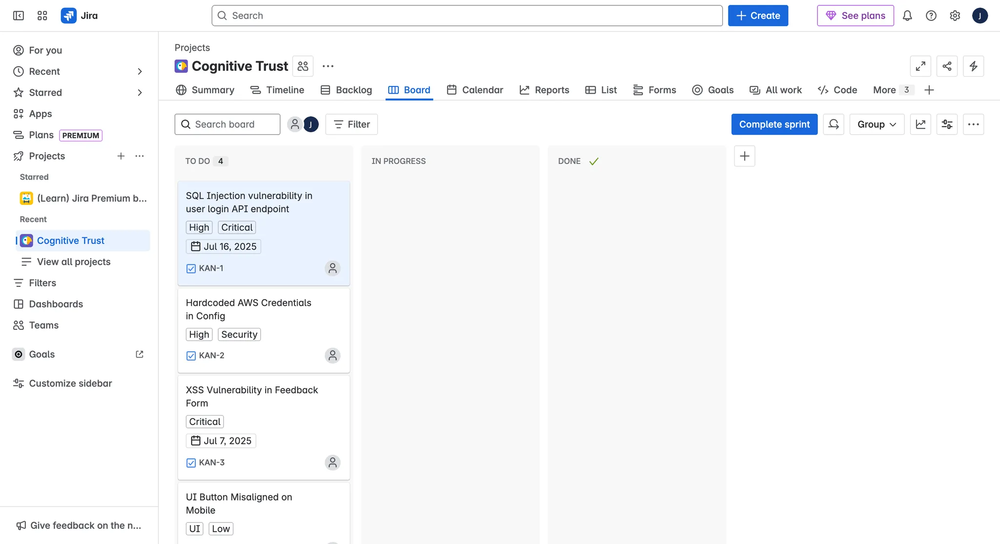
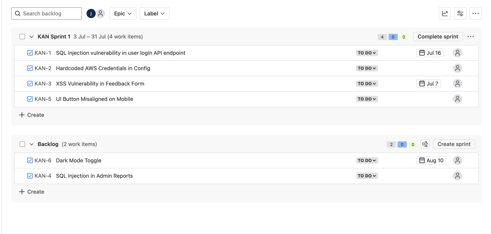
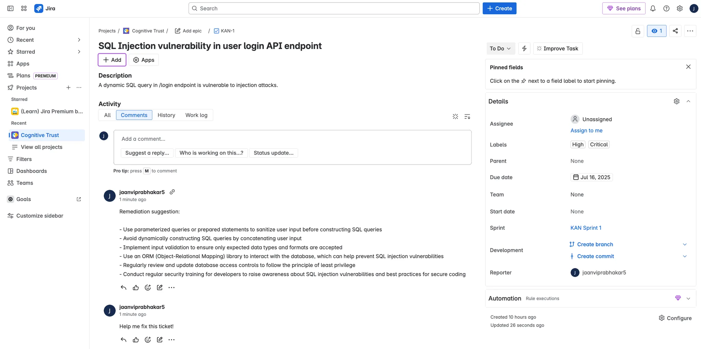
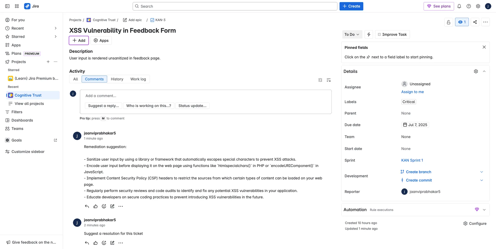
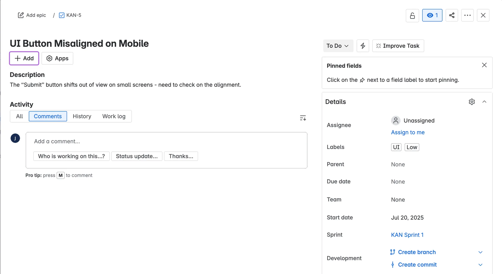
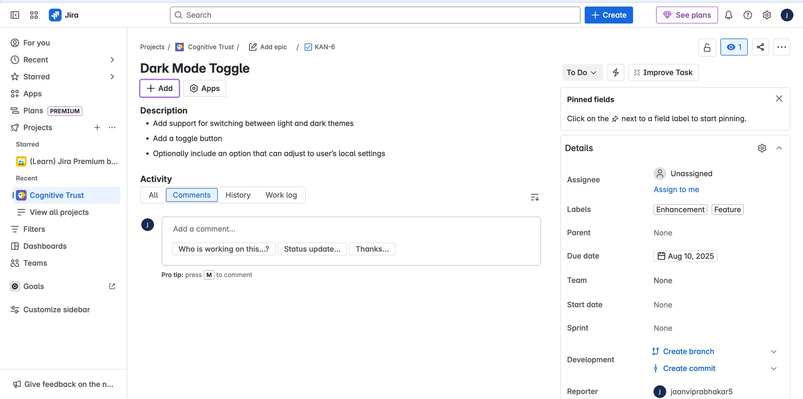
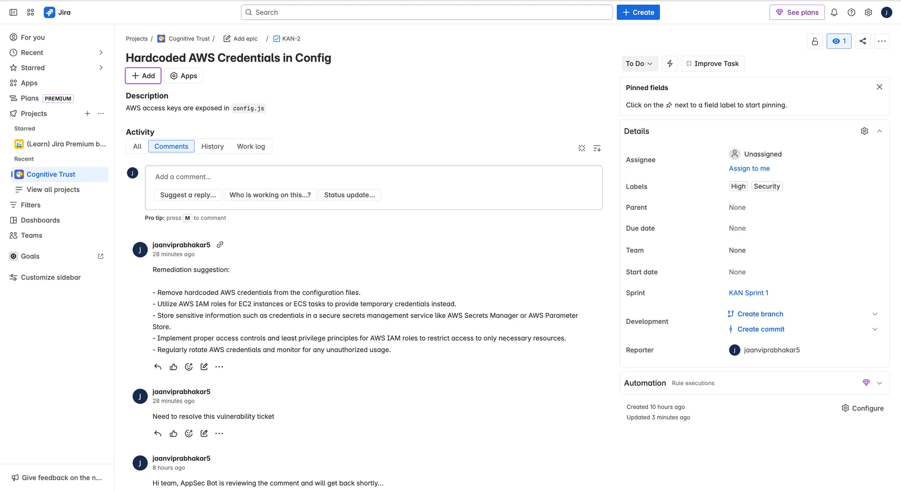
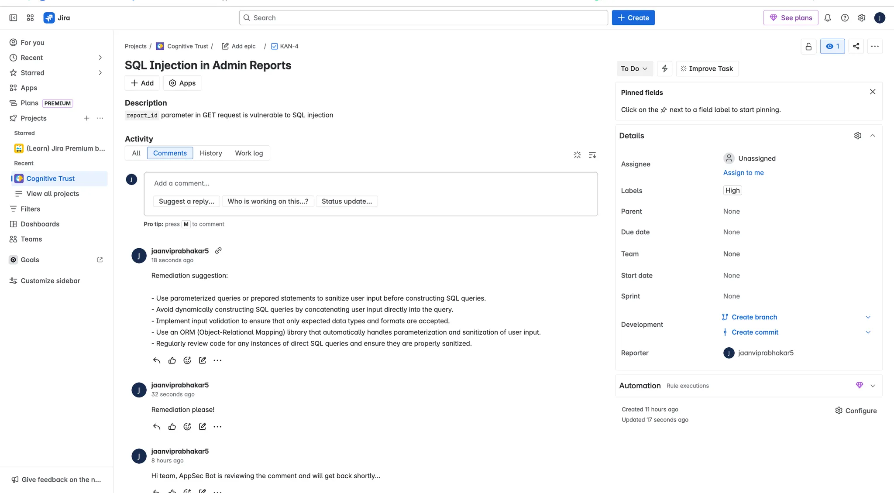
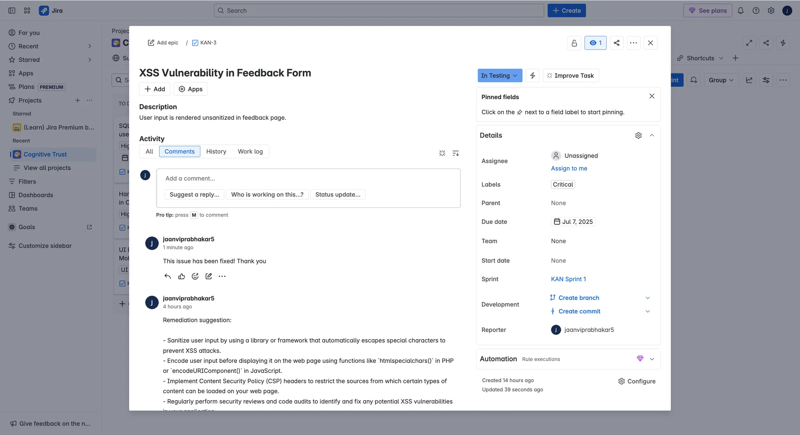
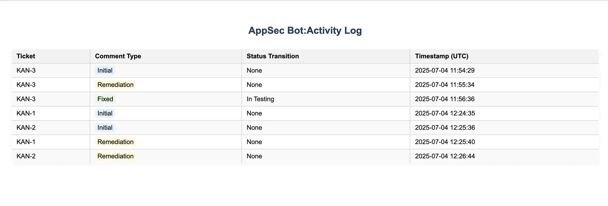

# AppSec Bot Assistant

> **AI-powered AppSec assistant for Jira – smart comments, remediation help, and ticket updates.**

## Overview

The AppSec Bot Assistant is a GenAI-powered virtual Application Security engineer. It monitors Jira tickets for high-risk vulnerabilities, automatically comments on developer threads, provides remediation advice using OpenAI, and updates the ticket status, all in real-time or near real-time.

## Features

- Connects to Jira Cloud via REST API
- Auto-comments on high & critical vulnerability tickets
- Detects developer messages like "Need help with remediation" and responds using OpenAI
- Recognizes "This has been fixed" and moves ticket to `In Testing`
- Logs all ticket interactions and status changes
- (Stretch) Maintains a stateful chat log per ticket
- (Stretch) Summarizes final resolution in a closing comment

## Tech Stack

- **Python 3**
- **FastAPI** – API backend & optional dashboard
- **OpenAI API** – LLM-powered responses
- **Jira REST API** – ticket management
- **JSON / SQLite** – lightweight logging
- **Uvicorn** – FastAPI ASGI server

## Setup Instructions

### 1. Clone the Repository

```bash
git clone https://github.com/jaanvi-prabhakar/appsec-bot.git
cd appsec-bot
```

## File Structure

<pre>
├── main.py # FastAPI entry point
├── jira_handler.py # Jira API logic
├── llm_handler.py # OpenAI integration
├── log_handler.py # Logging logic for web dashboard
├── state_manager.py # Chat memory (stretch)
├── templates/prompts.py # Prompt templates (stretch goal: later)
├── test_llm.py # to test generate_remediation_response from llm_handler
├── test_transitions.py # to get transition id for 'In Testing' 
├── logs/ticket_logs.json # JSON or SQLite logs
├── outputs/debugging
├── requirements.txt
└── README.md
</pre>

### 2. Install Dependencies

```
pip install -r requirements.txt
```

### 3. Set Environment Variables

Create a .env file in the root directory and add your credentials:

```
OPENAI_API_KEY=your_openai_key
JIRA_DOMAIN=yourcompany.atlassian.net
JIRA_EMAIL=your_email@example.com
JIRA_API_TOKEN=your_jira_api_token
```

### 4. Run the App

```
uvicorn main:app --reload
```

### 5. Logs on Web Dashboard

Visit http://localhost:8000/logs to view the activity dashboard.

## Requirements

- Python 3.9+
- OpenAI API Key
- Jira Cloud account with access token

## Contributing

Feel free to open issues or pull requests to improve the bot. Bug fixes, new features, and improvements are all welcome!

## License

This project is licensed under the MIT License.

## Screenshots [OUTPUTS]

### Tickets Created + Initial Steps




### Remediation Outputs: for tickets marked with high or critical label

1. 
2. 
3. 
4. 
5. 
6. 

### Fixed → In Testing



### Logs Dashboard



## Link to Demo Video

Coming soon
